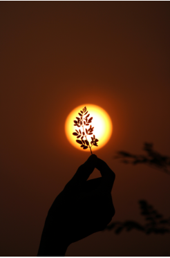

# IMAGETRANSFORMATION

# Aim
To perform image transformation such as Translation, Scaling, Shearing, Reflection, Rotation and Cropping using OpenCV and Python.

# Software Required:
Anaconda - Python 3.7

# Algorithm:
## Step1:
Import the required packages.

## Step2:
Load the image file in the program.

## Step3:
Use the techniques for Translation, Scaling, Shearing, Reflection, Rotation and Cropping using OpenCV and Python.

## Step4:
Display the modified image output.

## Step5:
End the program.

# Program:
```
Developed By: Akshayaa M
Register Number: 212222230009
```
### To Show The Original Image
```
import numpy as np
import cv2
import matplotlib.pyplot as plt
in_img=cv2.imread("sun.jpg")
in_img=cv2.cvtColor(in_img,cv2.COLOR_BGR2RGB)
plt.axis('off')
plt.imshow(in_img)
plt.show()
```
### i)Image Translation
```
import numpy as np
import cv2
import matplotlib.pyplot as plt
in_img=cv2.imread("sun.jpg")
in_img=cv2.cvtColor(in_img,cv2.COLOR_BGR2RGB)
rows,cols,dim=in_img.shape
M=np.float32([[1,0,250],
              [0,1,250],
              [0,0,1]])
trans_img=cv2.warpPerspective(in_img, M, (cols,rows))
plt.axis('off')
plt.imshow(trans_img)
plt.show() 
```
### ii) Image Scaling
```
import numpy as np
import cv2
import matplotlib.pyplot as plt
in_img=cv2.imread("sun.jpg")
in_img=cv2.cvtColor(in_img,cv2.COLOR_BGR2RGB)
rows,cols,dim=in_img.shape
M=np.float32([[1.5,0 ,0],
              [0,1.8,0],
              [0,0,1]])
scaled_img=cv2.warpPerspective(in_img, M,(cols,rows))
plt.axis('off')
plt.imshow(scaled_img)
plt.show()  
```
### iii)Image shearing
```
import numpy as np
import cv2
import matplotlib.pyplot as plt
in_img=cv2.imread("sun.jpg")
in_img=cv2.cvtColor(in_img,cv2.COLOR_BGR2RGB)
rows,cols,dim=in_img.shape
M_x=np.float32([[1,0.5,0],
                [0,1 ,0],
                [0,0 ,1]])
M_y=np.float32([[1,  0,0],
                [0.5,1,0],
                [0,  0,1]])
sheared_img_x=cv2.warpPerspective(in_img,M_x,(int(cols),int(rows)))
sheared_img_y=cv2.warpPerspective(in_img,M_y,(int(cols),int(rows)))
plt.axis('off')
plt.imshow(sheared_img_x)
plt.show()
plt.axis('off')
plt.imshow(sheared_img_y)
plt.show()
```
### iv)Image Reflection
```
import numpy as np
import cv2
import matplotlib.pyplot as plt
in_img=cv2.imread("sun.jpg")
in_img=cv2.cvtColor(in_img,cv2.COLOR_BGR2RGB)
rows,cols,dim=in_img.shape
M_x=np.float32([[1,  0,0  ],
                [0,-1,rows],
                [0,0,1  ]])
M_y=np.float32([[-1,0,cols],
                [ 0,1,0  ],
                [ 0,0,1  ]])
reflect_x=cv2.warpPerspective(in_img,M_x,(int(cols),int(rows)))
reflect_y=cv2.warpPerspective(in_img,M_y,(int(cols),int(rows)))
plt.axis('off')
plt.imshow(reflect_x)
plt.show()
plt.axis('off')
plt.imshow(reflect_y)
plt.show()  
```
### v)Image Rotation
```
import numpy as np
import cv2
import matplotlib.pyplot as plt
in_img=cv2.imread("sun.jpg")
in_img=cv2.cvtColor(in_img,cv2.COLOR_BGR2RGB)
rows,cols,dim=in_img.shape
angle=np.radians(10)
M=np.float32([[np.cos(angle),-(np.sin(angle)),0],
              [np.sin(angle),np.cos(angle),0],
              [0,0,1]])
rotated_img=cv2.warpPerspective(in_img,M,(int(cols),int(rows)))
plt.axis('off')
plt.imshow(rotated_img)
plt.show() 
```
### vi)Image Cropping
```
import numpy as np
import cv2
import matplotlib.pyplot as plt
in_img = cv2.imread("sun.jpg")
in_img = cv2.cvtColor(in_img,cv2.COLOR_BGR2RGB)
plt.imshow(in_img)
plt.show()
cropped_img=in_img[2000:3000 ,1000:2500]
plt.imshow(cropped_img)
plt.show()
```
# Output:
## Original Image

## i)Image Translation

## ii) Image Scaling

## iii)Image shearing


## iv)Image Reflection


## v)Image Rotation

## vi)Image Cropping


# Result: 

Thus the different image transformations such as Translation, Scaling, Shearing, Reflection, Rotation and Cropping are done using OpenCV and python programming.
